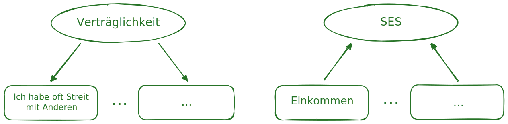

Wie zuvor angedeutet, ist ein Kernmerkmal von SEMs die Möglichkeit latente Variablen zu modellieren. Damit erlauben SEMs die getrennte Modellierung von Messfehlern und Konstruktzusammenhängen, bzw. erlauben den Versciht der Annahme von Messfehlerfreieheit, wie sind in der klassischen Rgeressionsanalyse, ANOVA oder t-Tests üblich sind.

# Latente und manifeste Variablen
In einführenden Lehrbüchern liest man typischerweise, dass manifeste Variablen direkt beobachtbare Größen sind, während latente Variablen nicht direkt beobachtbar Größen seien. Während diese Unterscheidung in der Praxis oft so hingenommen wird, ist sie bei genauerer Betrachtung schiwerig: Ist das Alter einer Person direkt beobachtbar? Oder die Körpergröße? Die Temperatur eines Raumes?

## Kriterien für manifeste Variablen 
In zwei wirklich lesenswerten Publikationen hat Danny Borsboom [@borsboom2003; @borsboom2008] den State of the Art zur Frage der Unterscheidung von latenten und manifesten Variablen sehr lesenwert zusammengefasst. Er schlägt vor diese Unterscheidung als *epistemisches* (nicht *ontologisches*) Problem zu betrachten und schlägt drei Kriterien vor, die eine manifeste Variable erfüllen muss:

> "Stattdessen postuliert Borsboom (2008) drei notwendige Bedingungen für die Beziehung von Daten- und Variablenstruktur, damit eine Variable als ‚beobachtet‘ gilt: Sie muss erstens deterministisch, zweitens kausal isoliert und drittens von äquivalenter Kardinalität sein. Die ersten beiden Bedingungen implizieren in Kombination, dass die Variablenausprägung durch die Daten und nur durch die Daten determiniert ist, also nicht etwa soziale Erwünschtheit zusätzliche Varianz beiträgt. Die dritte Voraussetzung meint, dass es gleich viele Datenmuster wie Variablenmuster geben muss. Dies ist etwa bei Kompetenzmessungen auf der Basis von Klassischer Testtheorie oder Item-Response-Theorie verletzt: Während die Daten (Antworten der Testaufgaben) nur endlich viele Muster aufweisen, kann bereits eine Variablenausprägung (z. B. Fähigkeitsparameter θ) überabzählbar viele Werte annehmen." [@merk2023a, S. 145]

Dieser Definiotion nach sind wohl die allermeisten sozialwissenschaftlichen Variablen latente Variablen, da sie nicht deterministisch, kausal isoliert und von äquivalenter Kardinalität sind. Damit lohnt es sich genauer auf die Beziehung der Daten und der latwenten variablen zu schauen, was uns im nächsten Abschnitt zu der Unterscheidung von formativen und reflektiven Messmodellen führt.

## Reflektive und formative Messmodelle
Wenn aus einer Geburtsurkunde auf das Alter einer Person geschlossen wird oder aus den Kreuzen eines Multiple-Choice-Testheftes auf die Mathematikkompetenz einer Person wird anhand von Daten bzgl. der Welt geschlussfolgert. Ein zunächst sehr akademisch wirkender, aber dennoch praktisch relevanter Punkt dabei ist die Annahme ob die Daten die latente Variable »reflektieren« oder »formen«, also ob die latente Variable die Daten beeinflusst oder umgekehrt. In einem reflektiven Messmodell wird angenommen, dass die latente Variable die Daten verursacht, während in einem formativen Messmodell angenommen wird, dass die Daten die latente Variable verursachen [@coltman2008].
Als ein typisches Beispiel kann die Beziehung zwischen dem Persönlichkeitsmerkmal Extraversion und dem Item "Ich habe oft Streit  mit anderen" bzw. dem Sozioökonomischen Status und dem Einkommen herangezogen werden.

{#fig-reflective_formative width=100%}

Während im ersten Fall die latente Variable Extraversion die Antworten auf das Item beeinflusst, wird im zweiten Fall angenommen, dass der sozioökonomische Status durch das Einkommen beeinflusst wird. Die Richtung des Einflusses kann dabei theoretisch oder über Gedankenexperimente erschlossen werden - ist aber natürlich nicht immer unumstritten: Gewinnt eine Person etwa eine Sofortrente steigt ihr Sozioökonomischer Status, also beeinflusst das Einkommen den SES. Bricht man andereseits mit einer sehr verträglichen Person jeden tag Streit vom Zaun, kreuzt diese Person wahrscheinlich auch häufiger das Item "Ich habe oft Streit mit anderen", aber ihre Verträglichkeit ändert sich nicht. Hier beeinflusst also die latente Variable Verträglichkeit den Indikator.

::: callout
### Übung 
Notieren Sie zwei Variablen, die zentral für ihr aktuelles Forschungsvorhaben sind.

1) Würde Sie diese als latent oder manifest klassifizieren?
2) Falls latent: Würden Sie diese als reflektiv oder formativ operationalisiert klassifizieren?

Pitchen Sie Ihre Überlegungen der Sitznachbarin bzw. dem Sitznachbarn.
:::