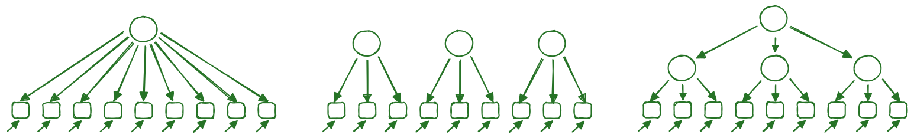
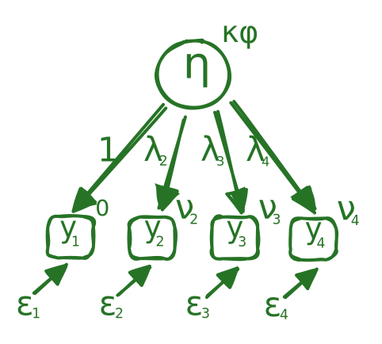

In diesem Abschnitt beschäftigen wir uns damit, anhand von gemessenen Variablen (Indikatoren) latente Konstrukte zu bilden (Messmodellierung), bzw. theoretische Annahmen über das Verhältnis von latenten Variablen und Indikatoren zu prüfen (konfirmatorische Faktorenanalyse).

# Messmodelle und Klassische Testtheorie 
Unter »Klassischer Testtheorie« fasst man eine Familie von Messmodellen, die in den historischen Ursprüngen der Psychometrie wurzeln [@spearman1904a; @spearman1904b]. Ihnen gemeinsam ist die Annahme, dass sich Messwerte in eine wahre Wertkomponente und eine Fehlerkomponente zerlegen lassen:

$$
\underbrace{Y_i}_{\text{Messwert}} = \underbrace{\tau_i}_{\text{True Score}} + \underbrace{\epsilon_i}_{\text{Messfehler}}
$$ {#eq-ctt}


Daraus lässt sich dass auch eine formale Definition der Reliabilität eines Messinstruments definieren und zwar als das Verhältnis der Varianz des wahren Werts zur Varianz des Messwerts:

$$
\text{Reliabilität} = \frac{\text{Var}(\tau)}{\text{Var}(Y)}
$$ {#eq-rel}

Aus @eq-ctt folgt schon direkt,

* dass die Reliabilität eines Messinstruments zwischen 0 und 1 liegen muss,
* in homogenen Stichproben die Reliabilität unterschätzt wird und
* die Reliabilität unabhängig von der Ausprägung des wahren Werts konzeptualisiert ist.

# Die Grundidee konfirmatorischer Faktorenanalysen
Die konfirmatorische Faktorenanalyse (CFA) ist ein klassiches Beispiel für die deduktive Vorgehensweise explanativer Sozialwissenschaftlicher Methodologie: 
Sie postuliert zunächst ein theoretisches Modell über die Beziehung zwischen latenten Variablen und deren Indikatoren - z.B. Intelligenz ist eine allgemeine generische Disposition zur Lösung numerischer, verbaler und anderer abstrakter Probleme [Explanans; @hempel1948]. Aus dieser allgemeingültigen Gesetzesaussage wird dann ein konkretes empirisches Beispiel abgeleitet (deduziert), das dann mit Daten überprüft werden kann. In diesem Fall könnte die deduzierte Hypothese lauten: Es gibt eine latente Variable »Intelligenz«, die sich in den Indikatoren »numerische Intelligenz«, »verbale Intelligenz« und »räumliche Intelligenz« manifestiert. 

{#fig-cfa_models width=100%}

Nun kann zum einen geprüft werden, inwiefern beobachtete Daten mit diesem Modell übereinstimmen, zum anderen kann aber auch die Passung zu konkurrierenden Modellen geprüft werden, z.B. einem Modell, das davon ausgeht, dass es drei voneinander unabhängige Intelligenztypen gibt, die sich nicht auf eine gemeinsame latente Variable zurückführen lassen oder einem Modell das davon ausgeht, das es zwar drei Intelligenztypen gibt, diese aber von einer übergeordneten latenten Variable beeinflusst werden.
Die Quantifizierung der Passung eines Modell zu Daten kann auf sehr unterscheidliche Art und Weise erfolgen. Eine sehr naheligenede Idee ist sich zu überlegen, welche Korrelationsstruktur die Daten aufweisen sollten, wenn das Modell korrekt ist, und diese mit der tatsächlich vorgefundenen empirisch beobachteten Korrelationsstruktur zu vergleichen.
```{r}
#| label: fig-corr-heatmaps
#| fig-cap: "Empirische Korrelationsmatrizen simulierter Daten für die drei postulierten Intelligenzmodelle aus @fig-cfa_models"
#| fig-subcap: 
#|   - "Heatmap A"
#|   - "Heatmap B"
#|   - "Heatmap C"
#| layout-ncol: 3
#| echo: false
#| message: false

library(MASS)
library(ggplot2)
library(tidyr)
library(brand.yml)

# Farbskala: -1 = #d77d00 (orange), 0 = weiß, 1 = #267326 (grün)
brand_colors <- scale_fill_gradient2(
  low = "#d77d00", mid = "white", high = "#267326",
  midpoint = 0, limits = c(-1, 1)
)

set.seed(42)
n <- 300

# Hilfsfunktion für Heatmap
plot_corr_heatmap <- function(cor_matrix, title = "") {
  cor_df <- as.data.frame(cor_matrix)
  cor_df$Var1 <- rownames(cor_matrix)
  cor_long <- pivot_longer(cor_df, cols = -Var1, names_to = "Var2", values_to = "r")
  cor_long$Var1 <- factor(cor_long$Var1, levels = rev(rownames(cor_matrix)))
  cor_long$Var2 <- factor(cor_long$Var2, levels = rownames(cor_matrix))
  
  ggplot(cor_long, aes(x = Var2, y = Var1, fill = r)) +
    geom_tile(color = "white") +
    geom_text(aes(label = round(r, 2)), size = 3) +
    brand_colors +
    labs(x = "", y = "", fill = "r") +
    theme_minimal() +
    theme(axis.text.x = element_text(angle = 45, hjust = 1)) +
    theme_brand_ggplot2()
}

# --- Modell 1: Drei unkorrelierte Faktoren ---
# Y1-Y3 laden auf F1, Y4-Y6 auf F2, Y7-Y9 auf F3 (unkorreliert)
lambda_3f <- c(.75, .8, .7, .72, .78, .74, .76, .71, .79)
Sigma_3f <- diag(9)
# Faktor 1: Y1-Y3
for(i in 1:3) for(j in 1:3) if(i != j) Sigma_3f[i,j] <- lambda_3f[i] * lambda_3f[j]
# Faktor 2: Y4-Y6
for(i in 4:6) for(j in 4:6) if(i != j) Sigma_3f[i,j] <- lambda_3f[i] * lambda_3f[j]
# Faktor 3: Y7-Y9
for(i in 7:9) for(j in 7:9) if(i != j) Sigma_3f[i,j] <- lambda_3f[i] * lambda_3f[j]
rownames(Sigma_3f) <- colnames(Sigma_3f) <- paste0("Y", 1:9)
data_3f <- mvrnorm(n, mu = rep(0, 9), Sigma = Sigma_3f)
cor_3f <- cor(data_3f)

plot_corr_heatmap(cor_3f)

# --- Modell 2: Ein-Faktor-Modell (g-Faktor) ---
# Alle 9 Indikatoren laden auf einen gemeinsamen Faktor
lambda_1f <- c(.7, .75, .65, .8, .7, .72, .68, .77, .73)
Sigma_1f <- tcrossprod(lambda_1f) + diag(1 - lambda_1f^2)
rownames(Sigma_1f) <- colnames(Sigma_1f) <- paste0("Y", 1:9)
data_1f <- mvrnorm(n, mu = rep(0, 9), Sigma = Sigma_1f)
cor_1f <- cor(data_1f)

plot_corr_heatmap(cor_1f)

# --- Modell 3: Hierarchisches Modell (g + 3 Gruppenfaktoren) ---
# g-Faktor beeinflusst 3 Gruppenfaktoren, diese beeinflussen je 3 Indikatoren
gamma <- c(.8, .75, .85)  # Ladungen der Gruppenfaktoren auf g
lambda_h <- c(.7, .75, .72, .74, .78, .71, .76, .73, .77)  # Ladungen auf Gruppenfaktoren

# Kovarianz zwischen Indikatoren
Sigma_h <- diag(9)
for(i in 1:9) {
  for(j in 1:9) {
    if(i != j) {
      group_i <- ceiling(i/3)
      group_j <- ceiling(j/3)
      if(group_i == group_j) {
        # Gleicher Gruppenfaktor: lambda_i * lambda_j * (1) + gamma^2 Anteil
        Sigma_h[i,j] <- lambda_h[i] * lambda_h[j]
      } else {
        # Verschiedene Gruppenfaktoren: nur über g-Faktor
        Sigma_h[i,j] <- lambda_h[i] * gamma[group_i] * gamma[group_j] * lambda_h[j]
      }
    }
  }
}
rownames(Sigma_h) <- colnames(Sigma_h) <- paste0("Y", 1:9)
data_h <- mvrnorm(n, mu = rep(0, 9), Sigma = Sigma_h)
cor_h <- cor(data_h)

plot_corr_heatmap(cor_h)
```

::: callout
### Übung 
Welche der drei Heatmaps passt zu welchem Modell aus @fig-cfa_models? Diskutieren Sie Ihre Überlegungen mit der Sitznachbarin bzw. dem Sitznachbarn.
:::

# Die Quantifizierung der Modellpassung
Wie oben beschrieben, ist die Kernidee der konfirmatorischen Faktorenanalyse Modelle zu postulieren und diese dann anhand von Daten zu verifizieren/falisfizieren. So wären etwa die Daten aus Heatmap A (siehe @fig-corr-heatmaps) Evidenz für das mittlere Modell in @fig-cfa_models. 
Eine Herausforderung stellt nun die Quantifizierung dieser Evidenz dar: So ist zum Beispiel die folgende Heatmap sowohl mit dem mittlerem als auch dem rechten Modell aus @fig-cfa_models einigermaßen vereinbar. Aber welches Modell passt wie viel besser?

```{r}
#| label: fig-heatmap-ambiguous
#| fig-cap: "Heatmap mit einer Korrelationsstruktur, die sowohl mit dem unkorrelierten Dreifaktormodell als auch mit dem hierarchischen Modell einigermaßen vereinbar ist."
#| echo: false
#| out-width: 50%

# Hierarchisches Modell mit sehr schwachen Second-Order-Ladungen
# -> Korrelationen zwischen Gruppenfaktoren werden minimal
# -> Struktur ähnelt dem unkorrelierten Dreifaktormodell

set.seed(2026)
n_ambig <- 300

# Sehr schwache Ladungen des g-Faktors auf die Gruppenfaktoren
gamma_weak <- c(0.25, 0.4, 0.28)

# Starke Ladungen der Items auf ihre jeweiligen Gruppenfaktoren
lambda_ambig <- c(0.65, 0.60, 0.62,   # Faktor 1
                  0.68, 0.64, 0.66,   # Faktor 2
                  0.61, 0.69, 0.73)   # Faktor 3

# Kovarianzmatrix konstruieren
Sigma_ambig <- diag(9)
for(i in 1:9) {
  for(j in 1:9) {
    if(i != j) {
      group_i <- ceiling(i/3)
      group_j <- ceiling(j/3)
      if(group_i == group_j) {
        # Gleicher Gruppenfaktor: Kovarianz über Gruppenfaktor
        Sigma_ambig[i,j] <- lambda_ambig[i] * lambda_ambig[j]
      } else {
        # Verschiedene Gruppenfaktoren: nur über g-Faktor (sehr schwach!)
        Sigma_ambig[i,j] <- lambda_ambig[i] * gamma_weak[group_i] * 
                            gamma_weak[group_j] * lambda_ambig[j]
      }
    }
  }
}
rownames(Sigma_ambig) <- colnames(Sigma_ambig) <- paste0("Y", 1:9)

# Daten simulieren
data_ambig <- MASS::mvrnorm(n_ambig, mu = rep(0, 9), Sigma = Sigma_ambig)
cor_ambig <- cor(data_ambig)

# Heatmap plotten
plot_corr_heatmap(cor_ambig)
```


## Quantifizierung der Passung eines Messmodells
Zur Quantifizierung der Passung eines SEM zu einem Datensatz wird sich zu nutze gemacht, dass man die implizierte Kovarianzmatrix eines Modells unter Annahme multivariater Normalverteilung vorhersagen kann. Wie dies genau funktioniert, wird im nächsten Teil für ein Messmodell - das sogenannte $\tau$-kongenerische Messmodell - hergeleitet. 
Von dieser mdoellimplizierten Kovarianzmatrix $\Sigma(\theta)$ kann dann die Differenz zur empirischen Kovarianzmatrix $S$ auf verschiedene Art und Weise quantifiziert werden.


## Das $\tau$-kongenerische Messmodell
Ein sehr gebräuchliches Messmodell ist das sogenannte $\tau$-kongenerische Messmodell, das die Annahme macht, dass Items/Indikatoren unterschiedlich **schwierig ($\nu_i$)**, **reliabel ($\epsilon_i$)** und **»trennscharf« ($\lambda_i$)** sind:

{#fig-taugenericmm width="50%"}

::: callout
### Übung 
Welcher Begriff gehört zu welchem Parameter und zu welcher Item-Eigenschaften?

* Begriff: Faktorladung, Item-Intercept, Residualvarianz
* Paramater: $\nu_i$, $\lambda_i$ und $\epsilon_i$
* Eigenschaften: Schwierigkeit, Reliabilität und Trennschärfe
:::

##  Das Messmodell in Matrixnotation
In Anlehnung an die LISREL-Notation (vgl. Kapitel »Strukturgleichungsmodellierung: Ein Überblick«) lässt sich das $\tau$-kongenerische Messmodell für $p$ Indikatoren und eine latente Variable $\eta$ schreiben als:

$$
\mathbf{y} = \boldsymbol{\nu} + \boldsymbol{\Lambda} \eta + \boldsymbol{\varepsilon}
$$ {#eq-taucong}

wobei:

- $\mathbf{y}$ = Vektor der manifesten Indikatoren $(p \times 1)$
- $\boldsymbol{\nu}$ = Vektor der Intercepts $(p \times 1)$
- $\boldsymbol{\Lambda}$ = Vektor der Faktorladungen $(p \times 1)$
- $\eta$ = latente Variable (Skalar mit $\text{Var}(\eta) = \psi$)
- $\boldsymbol{\varepsilon}$ = Vektor der Messfehler $(p \times 1)$

Dabei wird angenommen, dass:

1. $\text{E}(\boldsymbol{\varepsilon}) = \mathbf{0}$ (Messfehler haben Erwartungswert Null)
2. $\text{Cov}(\eta, \boldsymbol{\varepsilon}) = \mathbf{0}$ (latente Variable und Messfehler sind unkorreliert)
3. $\boldsymbol{\Theta}_\varepsilon = \text{Cov}(\boldsymbol{\varepsilon})$ ist eine Diagonalmatrix (Messfehler sind untereinander unkorreliert)

## Herleitung der implizierten Kovarianzmatrix

Die Kovarianzmatrix der beobachteten Variablen $\mathbf{y}$ ergibt sich durch Anwendung der Kovarianzregeln auf @eq-taucong die folgende Gleichung, da $\boldsymbol{\nu}$ eine Konstante ist und somit nicht zur Kovarianz beiträgt.

$$
\boldsymbol{\Sigma}(\boldsymbol{\theta}) = \text{Cov}(\mathbf{y}) = \text{Cov}(\boldsymbol{\Lambda} \eta + \boldsymbol{\varepsilon})
$$

 Mit der Annahme der Unkorreliertheit von $\eta$ und $\boldsymbol{\varepsilon}$ folgt:

$$
\boldsymbol{\Sigma}(\boldsymbol{\theta}) = \boldsymbol{\Lambda} \text{Var}(\eta) \boldsymbol{\Lambda}^\top + \text{Cov}(\boldsymbol{\varepsilon})
$$

bzw. in kompakter Notation:

$$
\boldsymbol{\Sigma}(\boldsymbol{\theta}) = \boldsymbol{\Lambda} \psi \boldsymbol{\Lambda}^\top + \boldsymbol{\Theta}_\varepsilon
$$ {#eq-implied-cov}

## Struktur der implizierten Kovarianzmatrix

Die @eq-implied-cov zeigt, dass die implizierte Kovarianzmatrix aus zwei Komponenten besteht:

1. **Gemeinsame Varianz**: $\boldsymbol{\Lambda} \psi \boldsymbol{\Lambda}^\top$ – dieser Term erzeugt die Kovarianzen zwischen den Indikatoren, die durch die gemeinsame latente Variable erklärt werden
2. **Spezifische Varianz**: $\boldsymbol{\Theta}_\varepsilon$ – dieser Term enthält die Messfehlervarianzen auf der Diagonalen

Für zwei Indikatoren $y_i$ und $y_j$ ergibt sich konkret:

- **Varianz**: $\sigma_{ii} = \lambda_i^2 \psi + \theta_{\varepsilon_i}$
- **Kovarianz** (für $i \neq j$): $\sigma_{ij} = \lambda_i \lambda_j \psi$

Dies verdeutlicht die zentrale Annahme des Modells: **Alle Kovarianzen zwischen Indikatoren werden vollständig durch die gemeinsame latente Variable erklärt** (lokale Unabhängigkeit).

## Bewertung der Modellpassung: Fit-Indices
Die Parameter eines SEM werden meist mit Maximum-Likelihood-Verfahren geschätzt. Unter Annahme multivariater Normalverteilung der Daten lässt sich die Likelihood wie folgt formulieren:

$$
L(\boldsymbol{\theta}) = \prod_{i=1}^{N} \frac{1}{(2\pi)^{p/2} |\boldsymbol{\Sigma}(\boldsymbol{\theta})|^{1/2}} \exp\left(-\frac{1}{2}(\mathbf{x}_i - \boldsymbol{\mu})' \boldsymbol{\Sigma}(\boldsymbol{\theta})^{-1} (\mathbf{x}_i - \boldsymbol{\mu})\right)
$$ {#eq-likelihood}

wobei $N$ die Stichprobengröße, $p$ die Anzahl der Indikatoren, $\mathbf{x}_i$ der Beobachtungsvektor der $i$-ten Person und $\boldsymbol{\Sigma}(\boldsymbol{\theta})$ die modellimplizierte Kovarianzmatrix ist.

Da man sich unter dieser doch recht Umfangreichen Formel kaum etwas vorstellen kann ist in folgendem Kasten ein Minimalbeispiel für die Maximum-Likelihood-Schätzung eines Parameters gegeben.

:::callout
## Minimalbeispiel: Maximum-Likelihood-Schätzung
Eine Münze wird 4 mal geworfen und es werden 3 mal Kopf und 1 mal Zahl beobachtet. 
Der Münzwurf (Bernoulli-Verteilung) wird als datengenerierender Mechanismus angenommen, aber die Wahrscheinlichkeit für Kopf $\theta$ ist unbekannt.
Die Likelihood für die beobachteten Daten (3 Kopf, 1 Zahl) lässt sich mit einem Bäumchen bestimmen und ist $L(\theta) = 4 \cdot \theta^3 \cdot (1-\theta)^1$. Plottet man nun diese Likelihood gegen $\theta$, so erhält man den folgenden Graphen:

```{r}
#| label: fig-likelihood
#| out-width: 70%
#| echo: false
#| fig-align: "left"
#| message: false
#| warning: false
library(ggplot2)
library(plotly)

theta <- seq(0, 1, by = 0.01)
likelihood <- 4 * theta^3 * (1 - theta)^1
data <- data.frame(theta, likelihood)


ggplot(data, aes(x = theta, y = likelihood)) +
  geom_line() +
  labs(
    title = "Likelihood für die beobachteten Daten",
    x = expression(theta),
    y = "Likelihood"
  ) +
  theme_minimal() +
  theme_brand_ggplot2()
```

Dort kann man erkennen, dass wie erwartet die Likelihood für $\theta = 0.75$ maximiert wird. Die Maximum-Likelihood-Schätzung für $\theta$ ergibt also 0.75.

Ein weiteres interaktives Beispiel für die Maximum-Likelihood-Schätzung von Parametern einer Normalverteilung findet sich z.B. auf der Seite vin [Kristoffer Magnusson](https://rpsychologist.com/likelihood/).
:::


Zur Schätzung der Modellparameter und zur Bewertung der Modellpassung wird typischerweise nicht die Likelihood maximiert, sondern die folgende **Maximum-Likelihood-Schätzung (ML)**, bei der die folgende Diskrepanzfunktion $F$ minimiert wird:

$$
F_{\text{ML}} = \ln|\boldsymbol{\Sigma}(\boldsymbol{\theta})| - \ln|\mathbf{S}| + \text{tr}(\mathbf{S}\boldsymbol{\Sigma}(\boldsymbol{\theta})^{-1}) - p
$$ {#eq-ml-discrepancy}

wobei $p$ die Anzahl der beobachteten Variablen bezeichnet. Bei perfekter Passung ($\boldsymbol{\Sigma}(\boldsymbol{\theta}) = \mathbf{S}$) wird $F_{\text{ML}} = 0$.


### Der $\chi^2$-Test
Aufgrund der Tatsache, dass die Größe 

$$
\chi^2 = (N - 1) \cdot F_{\text{ML}}
$$ {#eq-chi2}

$\chi^2$-verteilt mit $df = \frac{p(p+1)}{2} - q$ Freiheitsgraden, wobei $q$ die Anzahl der geschätzten Parameter ist, lässt sich die Punkt-Nullhypothese $H_0: \boldsymbol{\Sigma} = \boldsymbol{\Sigma}(\boldsymbol{\theta})$ testen. Ein signifikanter $\chi^2$-Test ($p < .05$) spricht gegen die **perfekte** Passung des Modells die Daten. Ein $p > .05$ kann entweder durch perfekte Passung oder zu geringe statistische Power (zu kleine Stichprobe) verursacht werden.

::: {.callout-warning}
### Limitationen des $\chi^2$-Tests
Damit hat der $\chi^2$-Tests das typische Problem von frequentistischen Punkt-Nullhypothesen-Signifikanztests: Er kann keine Evidenz für die Nullhypothese liefern. Das ist hier besonders fatal, da die Nullhypothese die Wunschhypothese ist.
:::

#### Absolute Fit-Indices

Absolute Fit-Indices bewerten die Diskrepanz zwischen $\boldsymbol{\Sigma}(\boldsymbol{\theta})$ und $\mathbf{S}$ direkt:

**SRMR (Standardized Root Mean Square Residual):**

$$
\text{SRMR} = \sqrt{\frac{2 \sum_{i \leq j} \left(\frac{s_{ij} - \hat{\sigma}_{ij}}{\sqrt{s_{ii} s_{jj}}}\right)^2}{p(p+1)}}
$$ {#eq-srmr}

Der SRMR ist der durchschnittliche standardisierte Residualwert. 

**RMSEA (Root Mean Square Error of Approximation):**

$$
\text{RMSEA} = \sqrt{\frac{\chi^2 - df}{df(N-1)}}
$$ {#eq-rmsea}

Der RMSEA quantifiziert den approximativen Fehler pro Freiheitsgrad und korrigiert damit für Modellkomplexität.

#### Inkrementelle Fit-Indices

Inkrementelle (oder komparative) Fit-Indices vergleichen das spezifizierte Modell mit einem **Baseline-Modell** (typischerweise das Unabhängigkeitsmodell, das keine Kovarianzen zwischen Indikatoren annimmt):

**CFI (Comparative Fit Index):**

$$
\text{CFI} = 1 - \frac{\max(\chi^2_{\text{Modell}} - df_{\text{Modell}}, 0)}{\max(\chi^2_{\text{Baseline}} - df_{\text{Baseline}}, 0)}
$$ {#eq-cfi}

**TLI (Tucker-Lewis Index):**

$$
\text{TLI} = \frac{\frac{\chi^2_{\text{Baseline}}}{df_{\text{Baseline}}} - \frac{\chi^2_{\text{Modell}}}{df_{\text{Modell}}}}{\frac{\chi^2_{\text{Baseline}}}{df_{\text{Baseline}}} - 1}
$$ {#eq-tli}


### Visualisierung der Konzepte inkrementeller und absoluter Fit-Indices
```{r}
#| label: fig-fit-indices-visual
#| fig-cap: "Visualisierung der Fit-Index-Typen: Inkrementelle Indices zeigen den Fortschritt vom Null-Modell zum perfekten Modell, absolute Indices zeigen die verbleibende Diskrepanz."
#| fig-height: 5
#| out-width: 80%
#| echo: false
#| message: false

library(ggplot2)
library(tidyr)
library(patchwork)

# Beispieldaten für ein Modell mit gutem Fit
fit_data <- data.frame(
  Index = c("CFI", "TLI"),
  Erklärt = c(0.95, 0.93),
  Residual = c(0.05, 0.07)
)

fit_long <- fit_data |>
  pivot_longer(cols = c(Erklärt, Residual), 
               names_to = "Anteil", values_to = "Wert") |>
  mutate(Anteil = factor(Anteil, levels = c("Residual", "Erklärt")))

# Inkrementelle Indices: Stacked Bar
p1 <- ggplot(fit_long, aes(x = Index, y = Wert, fill = Anteil)) +
  geom_col(position = "stack", width = 0.5) +
  scale_fill_manual(
    values = c("Erklärt" = "#267326", "Residual" = "#d77d00"),
    labels = c("Erklärt" = "Verbesserung ggü. Null-Modell", 
               "Residual" = "Verbleibende Diskrepanz zum perfekten (saturierten)Modell")
  ) +
  scale_y_continuous(labels = scales::percent, limits = c(0, 1), 
                     breaks = seq(0, 1, 0.25)) +
  coord_flip() +
  labs(title = "Inkrementelle Fit-Indices",
       subtitle = "Wie viel vom Weg zum perfekten (saturierten) Modell ist geschafft?",
       x = NULL, y = NULL, fill = NULL) +
  theme_minimal() +
  theme(legend.position = "bottom")

# Absolute Indices: Lollipop-Plot (Misfit)
abs_data <- data.frame(
  Index = c("RMSEA", "SRMR"),
  Misfit = c(0.05, 0.04)
)

p2 <- ggplot(abs_data, aes(x = Index, y = Misfit)) +
  geom_segment(aes(x = Index, xend = Index, y = 0, yend = Misfit), 
               color = "#d77d00", linewidth = 1.5) +
  geom_point(color = "#d77d00", size = 5) +
  scale_y_continuous(limits = c(0, 0.12), breaks = seq(0, 0.12, 0.02)) +
  coord_flip() +
  labs(title = "Absolute Fit-Indices",
       subtitle = "Wie groß ist die Diskrepanz zwischen S und Σ(θ)?",
       x = NULL, y = "Misfit (kleiner = besser)") +
  theme_minimal()

(p1 / p2) & theme_brand_ggplot2()
```


### Fit-Index Benchmarks
Wir haben nun gesehen, dass Fit-Indices die Modellpassung quantifizieren und diese ein theoretisches Maximum und Minimum haben. Aber ab welchem Grenzwert kann ein Modell nun als verifiziert oder falisfiziert gelten?
In der Praxis sehnt man sich nach klaren Benchmarks, aber in der Realität halten diese (wie bei p-Werten, Bayes Faktoren, Effektstärken) meist nicht, was man sich von ihnen verspricht, da sie kontextsensitiv [@mcneish2021] sind: So wie ein Cohen's $d = .2$ je nach Kontext auch ein großer Effekt sein kann, kann ein $CFI = .95$ eine Misspezifikation oder ein ganz guter Fit darstellen. Stehen keine Simulationen oder kontextspezifischen Cut-Off-Werte zur Verfügung, werden zumeist die folgenden Benchmarks empfohlen [@marsh2004; @hu1999]

- **CFI/TLI**: $> 0.95$ für gute Passung, $> 0.90$ für akzeptable Passung
- **RMSEA**: $< 0.05$ für gute Passung, $< 0.08$ für akzeptable Passung
- **SRMR**: $< 0.08$ für gute Passung, $< 0.10$ für akzeptable Passung


XX(E+) 1. pays attention in class. `g4ptattn`
(E+) 2. completes homework on time. `g4pthwrk`
(E+) 3. works well with other children. `g4ptothr`
XX(E-) 4. loses, forgets, or misplaces materials. `g4ptmtrl`
XX(E-) 5. comes late to class. `g4ptlate`
XX(E+) 9. completes assigned seat work. `g4ptwork`
XX(E+) 13. is persistent when confronted with difficult problems. `g4ptpers`
(E-) 14. doesn't seem to know what is going on in class. `g4ptknow`
(E+) 17. approaches new assignments with sincere effort. `g4ptefrt`
(E-) 21. doesn't take independent initiative, must be helped to get started and kept going on work. `g4ptintv`
(E-) 22. prefers to do easy problems rather than hard ones. `g4pteasy`
(E+) 24. tries to finish assignments even when they are difficult. `g4ptfnsh`
(E-) 27. gets discouraged and stops trying when encounters an obstacle in schoolwork, is easily frustrated. `g4ptdsrg`
(N+) 7. acts restless, is often unable to sit still. `g4ptrstl`
XX(N+) 11. needs to be reprimanded. `g4ptrepr`
XX(N+) 12. annoys or interferes with peers' work. `g4ptanoy`
(N+) 20. talks with classmates too much. `g4ptalks`
(I+) 6. attempts to do his/her work thoroughly and well, rather than just trying to get by. `g4ptries`
XX(I+) 8. participates actively in discussions. `g4ptdisc`
XX(I+) 15. does more than just the assigned work. `g4ptextr`
(I-) 16. is withdrawn, uncommunicative. g4ptwthd
(I+) 19. asks questions to get more information. `g4ptasks`
(I+) 25. raises his/her hand to answer a question or volunteer information. `g4ptrais`
(I+) 26. goes to dictionary, encyclopedia, or other reference on his/her own to seek information. `g4ptseek`
XX(I+) 28. engages teacher in conversation about subject matter before or after school, or outside of class. `g4ptdiss`
X(V-) 18. is critical of peers who do well in school. `g4ptcrit`
X(V+) 10. thinks that school is important. `g4ptimpt`
XX(V-) 23. criticizes the importance of the subject matter. `g4ptcrts`
(??) 29. attends other school activities such as athletic contests, carnivals, and fundraising events. `g4ptextc`