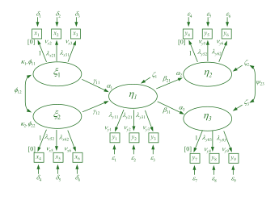

Was unter einem Strukturgleichungsmodell (SEM) zu verstehen ist, kann auf verschiedene Arten definiert werden. Da Lernende unterschiedliche Zugänge präferieren und zudem die Elaboration von Gemeinsamkeiten und Unterschieden der diversen Definitionen hilfreich sein kann, sollen hier drei verschiedene Ansätze der Definition vorgestellt werden. 

## Natürlichsprachige Umschreibung
Natürlichsprachlich umschreibend könnte man sagen, dass es sich bei SEM um statistische Modelle handelt, die es erlauben *mehrere messfehlerbereinigte Zusammenhänge simultan* zu schätzen. Damit sind SEM *multivariate Verfahren*, da mehrere abhängige Variablen gleichzeitig modelliert werden können. Zudem können in SEM Variablen als *abhängig und unabhängig gleichzeitig* spezifiziert werden und müssen nicht in Form von Daten vorliegen, sondern können auch als *latente Variablen* modelliert werden.

## Beschreibung als »Pfaddiagramm« 
Rund um die SEM hat es sich eingebürgert, die Modelle in Form von bestimmten Pfaddiagrammen zu visualisieren. Für diese gibt es mehrere Konventionen, wobei die verbreiteteste auf McArdle und McDonald [-@mcardle1984] sowie Jöreskog [@joreskog1973] zurückgeht.
In diesen Diagrammen werden latente Variablen als Kreise und manifeste Variablen als Rechtecke dargestellt. Die Beziehungen zwischen den Variablen werden durch gerichtete (Regressionen) und ungerichtete Pfeile (für Kovarianzen) dargestellt. 

{#fig-fullLISREL width=100%}

## Formale Definition
Linear-algebraisch lässt sich ein Strukturgleichungsmodell durch folgende (sog. LISREL Notation) Gleichungssysteme definieren:

### Messmodell (Measurement Model)

Das Messmodell beschreibt die Beziehung zwischen latenten Variablen und ihren manifesten Indikatoren:

$$
\mathbf{x} = \boldsymbol{\nu}_x + \boldsymbol{\Lambda}_x \boldsymbol{\xi} + \boldsymbol{\delta}
$$

$$
\mathbf{y} = \boldsymbol{\nu}_y + \boldsymbol{\Lambda}_y \boldsymbol{\eta} + \boldsymbol{\varepsilon}
$$

wobei:

- $\mathbf{x}$ = Vektor der exogenen manifesten Variablen $(q \times 1)$
- $\mathbf{y}$ = Vektor der endogenen manifesten Variablen $(p \times 1)$
- $\boldsymbol{\nu}_x$ = Vektor der Intercepts (Konstanten) für exogene Indikatoren $(q \times 1)$
- $\boldsymbol{\nu}_y$ = Vektor der Intercepts (Konstanten) für endogene Indikatoren $(p \times 1)$
- $\boldsymbol{\xi}$ = Vektor der exogenen latenten Variablen $(n \times 1)$
- $\boldsymbol{\eta}$ = Vektor der endogenen latenten Variablen $(m \times 1)$
- $\boldsymbol{\Lambda}_x$ = Faktorladungsmatrix für exogene Indikatoren $(q \times n)$
- $\boldsymbol{\Lambda}_y$ = Faktorladungsmatrix für endogene Indikatoren $(p \times m)$
- $\boldsymbol{\delta}$ = Messfehler der exogenen Indikatoren $(q \times 1)$
- $\boldsymbol{\varepsilon}$ = Messfehler der endogenen Indikatoren $(p \times 1)$

### Strukturmodell (Structural Model)

Das Strukturmodell beschreibt die Beziehungen zwischen den latenten Variablen:

$$
\boldsymbol{\eta} = \boldsymbol{\alpha} + \mathbf{B} \boldsymbol{\eta} + \boldsymbol{\Gamma} \boldsymbol{\xi} + \boldsymbol{\zeta}
$$

wobei:

- $\boldsymbol{\alpha}$ = Vektor der Intercepts (Konstanten) für die endogenen latenten Variablen $(m \times 1)$
- $\mathbf{B}$ = Matrix der Regressionskoeffizienten zwischen endogenen latenten Variablen $(m \times m)$
- $\boldsymbol{\Gamma}$ = Matrix der Regressionskoeffizienten von exogenen auf endogene latente Variablen $(m \times n)$
- $\boldsymbol{\zeta}$ = Vektor der Residuen der endogenen latenten Variablen $(m \times 1)$

### Kovarianzmatrizen

Zusätzlich werden folgende Kovarianzmatrizen spezifiziert:

- $\boldsymbol{\Phi} = \text{Cov}(\boldsymbol{\xi})$ = Kovarianzmatrix der exogenen latenten Variablen $(n \times n)$
- $\boldsymbol{\Psi} = \text{Cov}(\boldsymbol{\zeta})$ = Kovarianzmatrix der strukturellen Residuen $(m \times m)$
- $\boldsymbol{\Theta}_\delta = \text{Cov}(\boldsymbol{\delta})$ = Kovarianzmatrix der Messfehler von $\mathbf{x}$ $(q \times q)$
- $\boldsymbol{\Theta}_\varepsilon = \text{Cov}(\boldsymbol{\varepsilon})$ = Kovarianzmatrix der Messfehler von $\mathbf{y}$ $(p \times p)$

### Modellimplizierte Kovarianzmatrix

Die modellimplizierte Kovarianzmatrix $\boldsymbol{\Sigma}(\boldsymbol{\theta})$ ergibt sich als Funktion der Modellparameter $\boldsymbol{\theta}$. Ziel der Schätzung ist es, die Parameter so zu wählen, dass die Diskrepanz zwischen der empirischen Kovarianzmatrix $\mathbf{S}$ und der modellimplizierten Kovarianzmatrix $\boldsymbol{\Sigma}(\boldsymbol{\theta})$ minimiert wird.

